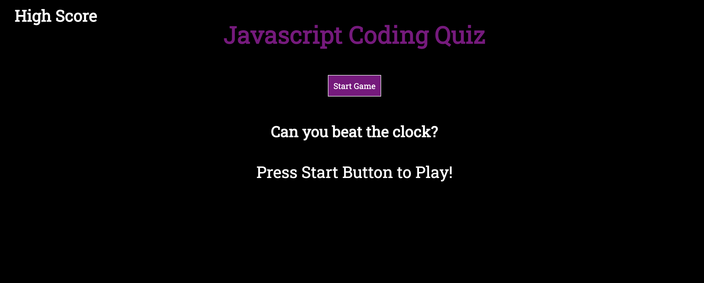
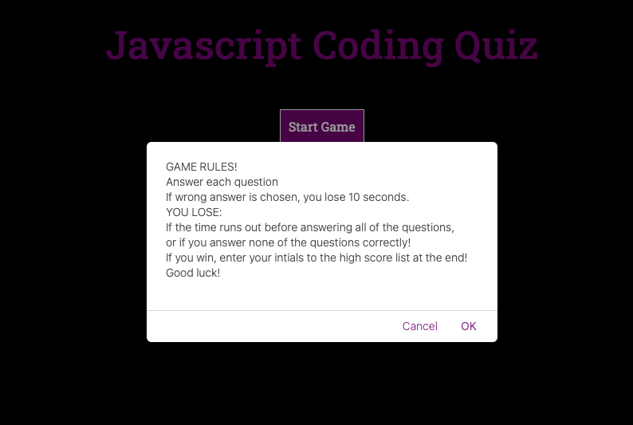
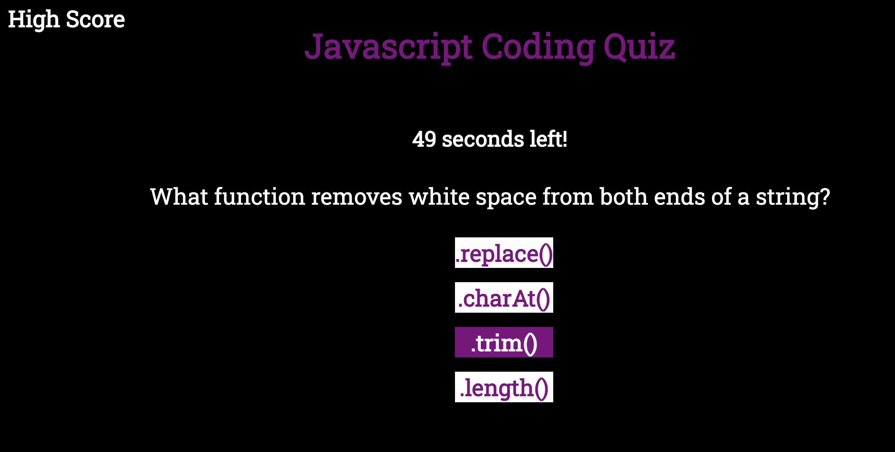
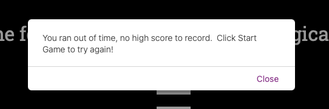
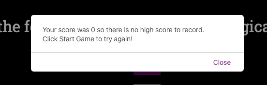
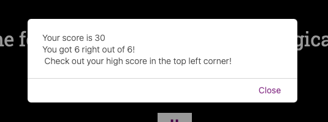
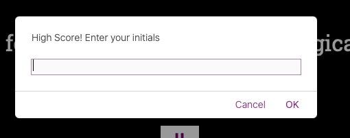
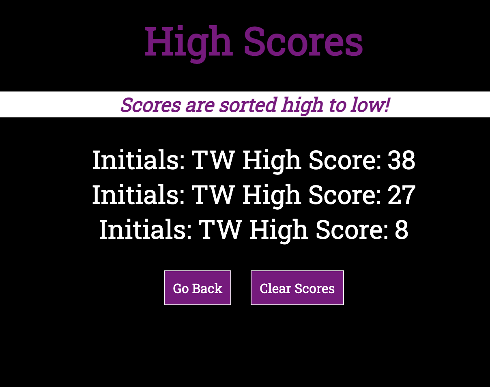

# Timed-Coding-Quiz

## Project Description

This project is a timed Coding Quiz to test the user's knowledge of Javascript.  To win, the user must beat the clock and answer at least one question correctly.  The user has the option of entering their high score at the end if they win.  The high scores are sorted highest to lowest and can be cleared by the user at anytime.

## Table of Contents 

- [About the Project](#about-the-project)
- [Installation](#installation)
- [Usage](#usage)
- [Credit](#credit)
- [License](#license)

## About the Project

- This project was built to create a timed coding quiz to test the user's knowledge of Javascript.
- The motiviation for this project was to utilize Javascript skills to create an interactive quiz that is timed and allows the user to enter their high score at the end of the game.  
- Once the user press starts, the rules to the game are displayed.
- When the alert is closed, the timer begins and the first question is displayed for the user.
- Any wrong answer results in ten seconds being deducted from the clock.
- If zero questions are answered correctly, or the time runs out, the user loses and no high scores are recorded.
- The final score is the amount of time left on the clock when the quiz is finished.
- The amount of correct questions answered will be displayed at the end before a high score can be entered.
- The high scores are logged and sorted highest to lowest, the user can clear the high score list at anytime.
- Comments have been added to all files to clarify each step and make future updates easier.

## Installation

- Open [Timed Coding Quiz](insert Github link here) 
- Or, open index.html in the internet browser.

## Usage

- Go to [Deployed Github Page](https://twashke.github.io/Timed-Coding-Quiz/)
- Click the Start Game button to play
- Beat the clock and answer at least one question right to win.
- For every question that is answered wrong, 10 seconds are deducted from the clock.
- Log high scores at the end.

Timed Coding Quiz Opening Screen \
 \
\
Game Rules Alert \
 \
\
Quiz Question \
 \
\
Ran Out of Time Alert \
 \
\
Answered Zero Correctly Alert \
 \
\
User Final Score Alert \
 \
\
High Score Input \
 \
\
High Score List (sorted highest to lowest) \
 

## Credit

- Joshua Washke for his time helping me understand and troubleshoot issues.

## License

- No license for this project.